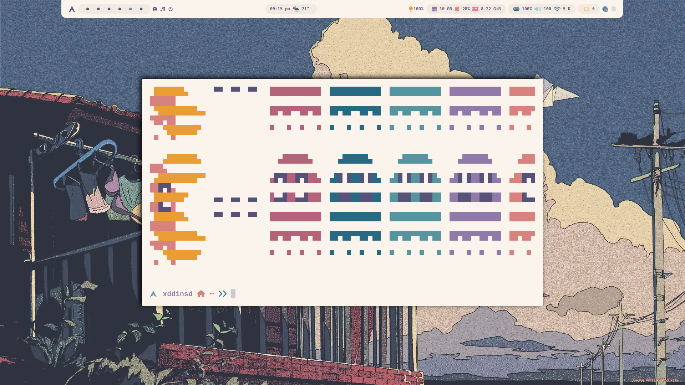

# My personal command set to install system from scratch
### * And 16 more awesome themes, god bless the Author of a [RiceSelector](https://github.com/gh0stzk/dotfiles/tree/master)  


### Installation
1) **Get a livecd of arch**
2) **Archinstall bspwm f2fs network-manager multilib**
3) **```nmcli d wifi connect <wifi_name> password <password>```**
4) **Install themes via [this config](https://github.com/gh0stzk/dotfiles/tree/master):** 
  ```bash
  curl https://raw.githubusercontent.com/gh0stzk/dotfiles/master/RiceInstaller -o $HOME/RiceInstaller
  ```
  ```bash
  chmod +x ./RiceInstaller
  ./RiceInstaller
  ```
5) **Once installed, deal with the other packages:**     
- yay:
  ```bash
  sudo pacman -S --needed git base-devel && git clone https://aur.archlinux.org/yay.git && cd yay && makepkg -si
   ```
  ```bash
  cd .. && sudo rm -r ./yay
  ```    
- Apps:
  ```bash
  yay -S micro code qsynth telegram-desktop steam zoom dissent-bin
  ```
- Utils:
```bash
yay -S  gvfs unrar pavucontrol zip unzip
# gvfs is for thunar
```
6) **Clone repo to home folder. This happens:**
- Hotkeys are honed for maximum performance to control your computer almost without a mouse(sxhkdrc)
- Default editor swapped to Code-OSS(OpenApps)
- Add script to swap keyboard layout to ru_RU(change_launguage.sh, it's linked to sxhkdrc via Shift+Alt hotkey)
  
7) **Configure manually apps:**
- Firefox
- Pavucontrol
- Telegram Desktop
- Steam
- Vscode + git
- Qsynth add path ```$HOME/.config/soundfonts```
- Add sound files to ~/Music/ in case you want to use the default polybar music player 
- [Dissent](https://github.com/diamondburned/dissent)
     
### Known errors:
- After installations hotkeys may not work until reboot
- **Change_launguage need to be opened manually once to wake up the Xmodmap.** Alternative: ```xmodmap ~/.config/bspwm/scripts/change_launguage.sh```
- Firefox theme is not applied (bug in the original repo, now it's WIP)
- Thunar can't open files (This happens due to the lack of session manager, which is a default state for BSPWM).    
  Solutions:
  1) Add LXSession to the original config (makes your system less integral and harder to configure properly)
  2) Use built-in vim-like file manager ranger.
      **Maybe there are others session-managers independent apps, write please in issues if you know one.**

### Feel free to fork, change package list and configs in repo.
